# CDC Data Quality Validator

This repository contains a simple Azure-based CDC data quality validation system for a hackathon.

The system compares CDC data from PostgreSQL and SQL Server OLTP sources against replicated data in a PostgreSQL OLAP warehouse. Source data is generated only by stored procedures.

## Architecture

```mermaid
flowchart LR
    %% =========================================================
    %% Azure Data Quality Agent Architecture
    %% Stored procedures generate source OLTP data.
    %% PostgreSQL and SQL Server OLTP sources replicate into PostgreSQL OLAP.
    %% Database logs and pipeline logs are centralized in Azure Monitor / Log Analytics.
    %% Root Cause Agent reads validation results and centralized logs to recommend fixes.
    %% =========================================================

    %% Source-data generation
    subgraph GEN[Source Data Generation Layer]
        PG_PROC[PostgreSQL Stored Procedures<br/>Generate / mutate OLTP records]
        SQL_PROC[SQL Server Stored Procedures<br/>Generate / mutate OLTP records]
    end

    %% Source OLTP databases
    subgraph OLTP[Azure Source / OLTP Layer]
        PG_SRC[(Azure Database for PostgreSQL<br/>OLTP Source)]
        SQL_SRC[(Azure SQL Database / SQL Server<br/>OLTP Source)]
        PG_SRC_TABLES[PostgreSQL Source Tables<br/>transactions / events / audit columns]
        SQL_SRC_TABLES[SQL Server Source Tables<br/>transactions / events / audit columns]
        PG_DB_LOGS[PostgreSQL Database Logs]
        SQL_DB_LOGS[SQL Server Database Logs]
    end

    %% Replication pipeline
    subgraph REPL[OLTP to OLAP Replication Layer]
        PG_REPL[PostgreSQL → PostgreSQL Warehouse<br/>Replication Pipeline]
        SQL_REPL[SQL Server → PostgreSQL Warehouse<br/>Replication Pipeline]
        PIPELINE_LOGS[Replication Pipeline Logs<br/>run status / row counts / errors / duration]
    end

    %% Target warehouse
    subgraph WAREHOUSE[Azure Target / OLAP Layer]
        PG_DW[(Azure Database for PostgreSQL<br/>OLAP Data Warehouse Target)]
        STAGING[Warehouse Staging Tables]
        FACTS[Warehouse Fact Tables]
        DIMS[Warehouse Dimension Tables]
        LOAD_AUDIT[Warehouse Load Audit Tables]
        VALIDATION_HISTORY[Validation History Tables]
    end

    %% Central log area
    subgraph LOGS[Centralized Azure Logging Area]
        LOG_ANALYTICS[(Azure Monitor / Log Analytics Workspace<br/>Central log store)]
        LOG_QUERIES[Saved Log Queries<br/>DB errors / pipeline failures / slow steps]
    end

    %% Agent layer
    subgraph AGENTS[Data Quality Agent Layer]
        FRONT[Front Door Agent<br/>Receives validation request]
        VALIDATE[Validation Agent<br/>Chooses validation checks]
        EXEC[Executor Agent<br/>Runs approved read-only SQL checks]
        ROOT[Root Cause Agent<br/>Reads validation failures + centralized logs<br/>Recommends what to fix]
    end

    %% Outputs
    subgraph OUTPUT[Outputs]
        REPORT[Validation Report<br/>Pass/fail + likely cause + recommended fix]
        TEAMS[Teams Alert / Notification]
        TICKET[Ticket / Work Item Draft]
    end

    %% Stored procedures generate new OLTP data
    PG_PROC --> PG_SRC
    SQL_PROC --> SQL_SRC
    PG_SRC --> PG_SRC_TABLES
    SQL_SRC --> SQL_SRC_TABLES

    %% Replication from OLTP to OLAP warehouse
    PG_SRC_TABLES --> PG_REPL
    SQL_SRC_TABLES --> SQL_REPL
    PG_REPL --> STAGING
    SQL_REPL --> STAGING
    STAGING --> FACTS
    STAGING --> DIMS
    FACTS --> PG_DW
    DIMS --> PG_DW
    LOAD_AUDIT --> PG_DW
    VALIDATION_HISTORY --> PG_DW

    %% Logs centralized into Azure Monitor / Log Analytics
    PG_SRC --> PG_DB_LOGS
    SQL_SRC --> SQL_DB_LOGS
    PG_REPL --> PIPELINE_LOGS
    SQL_REPL --> PIPELINE_LOGS
    PG_DB_LOGS --> LOG_ANALYTICS
    SQL_DB_LOGS --> LOG_ANALYTICS
    PIPELINE_LOGS --> LOG_ANALYTICS
    LOG_ANALYTICS --> LOG_QUERIES

    %% Agent workflow
    FRONT --> VALIDATE
    VALIDATE --> EXEC
    EXEC --> PG_SRC_TABLES
    EXEC --> SQL_SRC_TABLES
    EXEC --> PG_DW
    EXEC --> VALIDATION_HISTORY
    EXEC --> ROOT

    %% Root cause agent uses centralized logs and validation results
    LOG_ANALYTICS --> ROOT
    LOG_QUERIES --> ROOT
    VALIDATION_HISTORY --> ROOT

    %% Outputs
    ROOT --> REPORT
    REPORT --> TEAMS
    REPORT --> TICKET
```

## Files

- [Project plan](cdc_stored_proc_data_quality_project_plan.md)
- [Main architecture diagram](diagrams/azure_data_quality_agent_architecture.mmd)
- [Copilot instructions](.github/copilot-instructions.md)
- [Shared CDC validation instructions](.github/instructions/cdc-validation.instructions.md)
- [Agent role instructions](.github/instructions/agent-roles.instructions.md)
- [Front Door Agent](.github/agents/front-door.agent.md)
- [Validation Agent](.github/agents/validation.agent.md)
- [Executor Agent](.github/agents/executor.agent.md)
- [Root Cause Agent](.github/agents/root-cause.agent.md)
