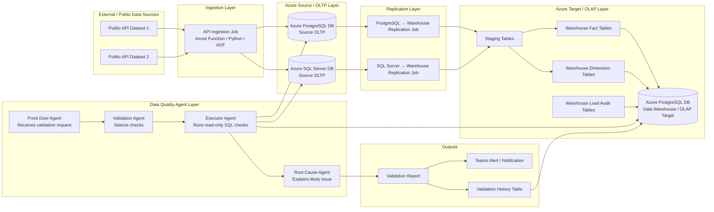
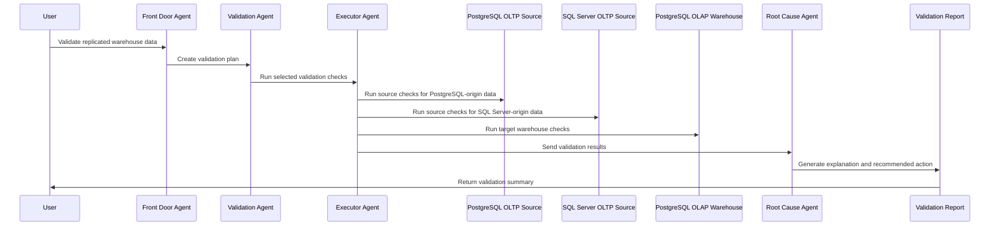

# Azure Data Quality Agent System Diagrams

## System Architecture Diagram

```mermaid
flowchart LR
    %% External Data Sources
    subgraph EXT[External / Public Data Sources]
        API1[Public API Dataset 1]
        API2[Public API Dataset 2]
    end

    %% Source OLTP Databases
    subgraph OLTP[Azure Source / OLTP Layer]
        PG_SRC[(Azure PostgreSQL DB\nSource OLTP)]
        SQL_SRC[(Azure SQL Server DB\nSource OLTP)]
    end

    %% Ingestion Layer
    subgraph INGEST[Ingestion Layer]
        API_INGEST[API Ingestion Job\nAzure Function / Python / ADF]
    end

    %% Replication Layer
    subgraph REPL[Replication Layer]
        PG_REPL[PostgreSQL → Warehouse Replication Job]
        SQL_REPL[SQL Server → Warehouse Replication Job]
    end

    %% Target Warehouse
    subgraph WAREHOUSE[Azure Target / OLAP Layer]
        PG_DW[(Azure PostgreSQL DB\nData Warehouse / OLAP Target)]
        STAGING[Staging Tables]
        FACTS[Warehouse Fact Tables]
        DIMS[Warehouse Dimension Tables]
        AUDIT[Warehouse Load Audit Tables]
    end

    %% Agent Layer
    subgraph AGENTS[Data Quality Agent Layer]
        FRONT[Front Door Agent\nReceives validation request]
        VALIDATE[Validation Agent\nSelects checks]
        EXEC[Executor Agent\nRuns read-only SQL checks]
        ROOT[Root Cause Agent\nExplains likely issue]
    end

    %% Reporting / Output Layer
    subgraph OUTPUT[Outputs]
        REPORT[Validation Report]
        TEAMS[Teams Alert / Notification]
        HISTORY[Validation History Table]
    end

    %% Data Flow
    API1 --> API_INGEST
    API2 --> API_INGEST

    API_INGEST --> PG_SRC
    API_INGEST --> SQL_SRC

    PG_SRC --> PG_REPL
    SQL_SRC --> SQL_REPL

    PG_REPL --> STAGING
    SQL_REPL --> STAGING

    STAGING --> FACTS
    STAGING --> DIMS
    FACTS --> PG_DW
    DIMS --> PG_DW
    AUDIT --> PG_DW

    %% Agent Flow
    FRONT --> VALIDATE
    VALIDATE --> EXEC
    EXEC --> PG_SRC
    EXEC --> SQL_SRC
    EXEC --> PG_DW
    EXEC --> ROOT
    ROOT --> REPORT
    REPORT --> TEAMS
    REPORT --> HISTORY
    HISTORY --> PG_DW
```

## Validation Flow Sequence Diagram

```mermaid
sequenceDiagram
    participant User
    participant FrontDoor as Front Door Agent
    participant Validation as Validation Agent
    participant Executor as Executor Agent
    participant PgSource as PostgreSQL OLTP Source
    participant SqlSource as SQL Server OLTP Source
    participant Warehouse as PostgreSQL OLAP Warehouse
    participant RootCause as Root Cause Agent
    participant Report as Validation Report

    User->>FrontDoor: Validate replicated warehouse data
    FrontDoor->>Validation: Create validation plan
    Validation->>Executor: Run selected validation checks
    Executor->>PgSource: Run source checks for PostgreSQL-origin data
    Executor->>SqlSource: Run source checks for SQL Server-origin data
    Executor->>Warehouse: Run target warehouse checks
    Executor->>RootCause: Send validation results
    RootCause->>Report: Generate explanation and recommended action
    Report->>User: Return validation summary
```
